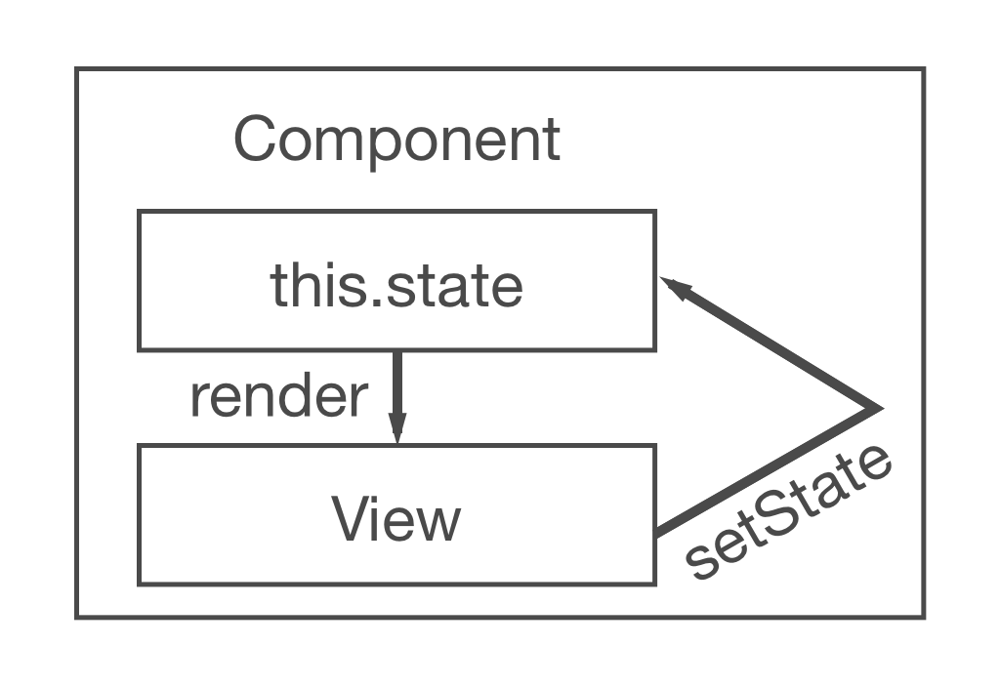

# Basics in React

The chapter will guide you through the basics of React. It covers state and interactions in components, because static components are a bit dull, aren't they? Additionally, you will learn about the different ways to declare a component and how to keep components composable and reusable. Be prepared to breathe life into your components.

## Internal Component State

Internal component state, also known as local state, allows you to save, modify and delete properties that are stored in your component. The ES6 class component can use a constructor to initialize internal component state later on. The constructor is called only once when the component initializes.

Let's introduce a class constructor.

{title="src/App.js",lang=javascript}
~~~~~~~~
class App extends Component {

# leanpub-start-insert
  constructor(props) {
    super(props);
  }
# leanpub-end-insert

  ...

}
~~~~~~~~

When having a constructor in your ES6 class component, it is mandatory to call `super();` because the App component is a subclass of `Component`. Hence the `extends Component` in your App component declaration. You will learn more about ES6 class components later on.

You can call `super(props);` as well. It sets `this.props` in your constructor in case you want to access them in the constructor. Otherwise, when accessing `this.props` in your constructor, they would be `undefined`. You will learn more about the props of a React component later on.

Now, in your case, the initial state in your component should be the sample list of items.

{title="src/App.js",lang=javascript}
~~~~~~~~
const list = [
  {
    title: 'React',
    url: 'https://facebook.github.io/react/',
    author: 'Jordan Walke',
    num_comments: 3,
    points: 4,
    objectID: 0,
  },
  ...
];

class App extends Component {

  constructor(props) {
    super(props);

# leanpub-start-insert
    this.state = {
      list: list,
    };
# leanpub-end-insert
  }

  ...

}
~~~~~~~~

The state is bound to the class by using the `this` object. Thus you can access the local state in your whole component. For instance, it can be used in the `render()` method. Previously you have mapped a static list of items in your `render()` method that was defined outside of your component. Now you are about to use the list from your local state in your component.

{title="src/App.js",lang=javascript}
~~~~~~~~
class App extends Component {

  ...

  render() {
    return (
      

# leanpub-start-insert
        {this.state.list.map(item =>
# leanpub-end-insert
          

            
              <a href={item.url}>{item.title}</a>
            
            {item.author}
            {item.num_comments}
            {item.points}
          

        )}
      

    );
  }
}
~~~~~~~~

The list is part of the component now. It resides in the internal component state. You could add items, change items or remove items in and from your list. Every time you change your component state, the `render()` method of your component will run again. That's how you can simply change your internal component state and be sure that the component re-renders and displays the correct data that comes from the local state.

But be careful. Don't mutate the state directly. You have to use a method called `setState()` to modify your state. You will get to know it in a following chapter.

### Exercises:

* experiment with the local state
  * define more initial state in the constructor
  * use and access the state in your `render()` method
* read more about [the ES6 class constructor](https://developer.mozilla.org/en/docs/Web/JavaScript/Reference/Classes#Constructor)

## ES6 Object Initializer

In JavaScript ES6, you can use a shorthand property syntax to initialize your objects more concisely. Imagine the following object initialization:

{title="Code Playground",lang="javascript"}
~~~~~~~~
const name = 'Robin';

const user = {
  name: name,
};
~~~~~~~~

When the property name in your object is the same as your variable name, you can do the following:

{title="Code Playground",lang="javascript"}
~~~~~~~~
const name = 'Robin';

const user = {
  name,
};
~~~~~~~~

In your application, you can do the same. The list variable name and the state property name share the same name.

{title="Code Playground",lang="javascript"}
~~~~~~~~
// ES5
this.state = {
  list: list,
};

// ES6
this.state = {
  list,
};
~~~~~~~~

Another neat helper are shorthand method names. In JavaScript ES6, you can initialize methods in an object more concisely.

{title="Code Playground",lang="javascript"}
~~~~~~~~
// ES5
var userService = {
  getUserName: function (user) {
    return user.firstname + ' ' + user.lastname;
  },
};

// ES6
const userService = {
  getUserName(user) {
    return user.firstname + ' ' + user.lastname;
  },
};
~~~~~~~~

Last but not least, you are allowed to use computed property names in JavaScript ES6.

{title="Code Playground",lang="javascript"}
~~~~~~~~
// ES5
var user = {
  name: 'Robin',
};

// ES6
const key = 'name';
const user = {
  [key]: 'Robin',
};
~~~~~~~~

Perhaps computed property names make no sense for you yet. Why should you need them? In a later chapter, you will come to a point where you can use them to allocate values by key in a dynamic way in an object. It's neat to generate lookup tables in JavaScript.

### Exercises:

* experiment with ES6 object initializer
* read more about [ES6 object initializer](https://developer.mozilla.org/en/docs/Web/JavaScript/Reference/Operators/Object_initializer)

## Unidirectional Data Flow

Now you have some internal state in your App component. However, you have not manipulated the local state yet. The state is static and thus is the component. A good way to experience state manipulation is to have some component interaction.

Let's add a button for each item in the displayed list. The button says "Dismiss" and is going to remove the item from the list. It could be useful eventually when you only want to keep a list of unread items and dismiss the items that you are not interested in.

{title="src/App.js",lang=javascript}
~~~~~~~~
class App extends Component {

  ...

  render() {
    return (
      

        {this.state.list.map(item =>
          

            
              <a href={item.url}>{item.title}</a>
            
            {item.author}
            {item.num_comments}
            {item.points}
# leanpub-start-insert
            
              <button
                onClick={() => this.onDismiss(item.objectID)}
                type="button"
              >
                Dismiss
              </button>
            
# leanpub-end-insert
          

        )}
      

    );
  }
}
~~~~~~~~

The `onDismiss()` class method is not defined yet. We will do it in a moment, but for now the focus should be on the `onClick` handler of the button element. As you can see, the `onDismiss()` method in the `onClick` handler is enclosed by another function. It is an arrow function. That way, you can sneak in the `objectID` property of the `item` object to identify the item that will be dismissed. An alternative way would be to define the function outside of the `onClick` handler and only pass the defined function to the handler. A later chapter will explain the topic of handlers in elements in more detail.

Did you notice the multilines for the button element? Note that elements with multiple attributes get messy as one line at some point. That's why the button element is used with multilines and indentations to keep it readable. But it is not mandatory. It is only a code style recommendation that I highly recommend.

Now you have to implement the `onDismiss()` functionality. It takes an id to identify the item to dismiss. The function is bound to the class and thus becomes a class method. That's why you access it with `this.onDismiss()` and not `onDismiss()`. The `this` object is your class instance. In order to define the `onDismiss()` as class method, you have to bind it in the constructor. Bindings will be explained in another chapter later on.

{title="src/App.js",lang=javascript}
~~~~~~~~
class App extends Component {

  constructor(props) {
    super(props);

    this.state = {
      list,
    };

# leanpub-start-insert
    this.onDismiss = this.onDismiss.bind(this);
# leanpub-end-insert
  }

  render() {
    ...
  }
}
~~~~~~~~

In the next step, you have to define its functionality, the business logic, in your class. Class methods can be defined the following way.

{title="src/App.js",lang=javascript}
~~~~~~~~
class App extends Component {

  constructor(props) {
    super(props);

    this.state = {
      list,
    };

    this.onDismiss = this.onDismiss.bind(this);
  }

# leanpub-start-insert
  onDismiss(id) {
    ...
  }
# leanpub-end-insert

  render() {
    ...
  }
}
~~~~~~~~

Now you are able to define what happens inside of the class method. Basically you want to remove the item identified by the id from the list and store an updated list to your local state. Afterward, the updated list will be used in the re-running `render()` method to display it. The removed item shouldn't appear anymore.

You can remove an item from a list by using the JavaScript built-in filter functionality. The filter function takes a function as input. The function has access to each value in the list, because it iterates over the list. That way, you can evaluate each item in the list based on a filter condition. If the evaluation for an item is true, the item stays in the list. Otherwise it will be filtered from the list. Additionally, it is good to know that the function returns a new list and doesn't mutate the old list. It supports the convention in React of having immutable data structures.

{title="src/App.js",lang=javascript}
~~~~~~~~
onDismiss(id) {
# leanpub-start-insert
  const updatedList = this.state.list.filter(function isNotId(item) {
    return item.objectID !== id;
  });
# leanpub-end-insert
}
~~~~~~~~

In the next step, you can extract the function and pass it to the filter function.

{title="src/App.js",lang=javascript}
~~~~~~~~
onDismiss(id) {
# leanpub-start-insert
  function isNotId(item) {
    return item.objectID !== id;
  }

  const updatedList = this.state.list.filter(isNotId);
# leanpub-end-insert
}
~~~~~~~~

In addition, you can do it more concisely by using a JavaScript ES6 arrow function again.

{title="src/App.js",lang=javascript}
~~~~~~~~
onDismiss(id) {
# leanpub-start-insert
  const isNotId = item => item.objectID !== id;
  const updatedList = this.state.list.filter(isNotId);
# leanpub-end-insert
}
~~~~~~~~

You could even inline it again, like you did in the `onClick` handler of the button, but it might get less readable.

{title="src/App.js",lang=javascript}
~~~~~~~~
onDismiss(id) {
# leanpub-start-insert
  const updatedList = this.state.list.filter(item => item.objectID !== id);
# leanpub-end-insert
}
~~~~~~~~

The list removes the clicked item now. However the state isn't updated yet. Therefore you can finally use the `setState()` class method to update the list in the internal component state.

{title="src/App.js",lang=javascript}
~~~~~~~~
onDismiss(id) {
  const isNotId = item => item.objectID !== id;
  const updatedList = this.state.list.filter(isNotId);
# leanpub-start-insert
  this.setState({ list: updatedList });
# leanpub-end-insert
}
~~~~~~~~

Now run again your application and try the "Dismiss" button. It should work. What you experience now is the **unidirectional data flow** in React. You trigger an action in your view with `onClick()`, a function or class method modifies the internal component state and the `render()` method of the component runs again to update the view.

### Exercises:

* read more about [the state and lifecycle in React](https://facebook.github.io/react/docs/state-and-lifecycle.html)

## Bindings

It is important to learn about bindings in JavaScript classes when using React ES6 class components. In the previous chapter, you have bound your class method `onDismiss()` in the constructor.

{title="src/App.js",lang=javascript}
~~~~~~~~
class App extends Component {
  constructor(props) {
    super(props);

    this.state = {
      list,
    };

    this.onDismiss = this.onDismiss.bind(this);
  }

  ...
}
~~~~~~~~

Why would you do that in the first place? The binding step is necessary, because class methods don't automatically bind `this` to the class instance. Let's demonstrate it with the help of the following ES6 class component.

{title="Code Playground",lang=javascript}
~~~~~~~~
class ExplainBindingsComponent extends Component {
  onClickMe() {
    console.log(this);
  }

  render() {
    return (
      <button
        onClick={this.onClickMe}
        type="button"
      >
        Click Me
      </button>
    );
  }
}
~~~~~~~~

The component renders just fine, but when you click the button, you will get `undefined` in your developer console log. That's a main source of bugs when using React, because if you want to access `this.state` in your class method, it cannot be retrieved because `this` is `undefined`. So in order to make `this` accessible in your class methods, you have to bind the class methods to `this`.

In the following class component the class method is properly bound in the class constructor.

{title="Code Playground",lang=javascript}
~~~~~~~~
class ExplainBindingsComponent extends Component {
# leanpub-start-insert
  constructor() {
    super();

    this.onClickMe = this.onClickMe.bind(this);
  }
# leanpub-end-insert

  onClickMe() {
    console.log(this);
  }

  render() {
    return (
      <button
        onClick={this.onClickMe}
        type="button"
      >
        Click Me
      </button>
    );
  }
}
~~~~~~~~

When trying the button again, the `this` object, to be more specific the class instance, should be defined and you would be able to access `this.state`, or as you will later learn `this.props`, now.

The class method binding can happen somewhere else too. For instance, it can happen in the `render()` class method.

{title="Code Playground",lang=javascript}
~~~~~~~~
class ExplainBindingsComponent extends Component {
  onClickMe() {
    console.log(this);
  }

  render() {
    return (
      <button
# leanpub-start-insert
        onClick={this.onClickMe.bind(this)}
# leanpub-end-insert
        type="button"
      >
        Click Me
      </button>
    );
  }
}
~~~~~~~~

But you should avoid it, because it would bind the class method every time when the `render()` method runs. Basically it runs every time your component updates which leads to performance implications. When binding the class method in the constructor, you bind it only once in the beginning when the component is instantiated. That's a better approach to do it.

Another thing people sometimes come up with is defining the business logic of their class methods in the constructor.

{title="Code Playground",lang=javascript}
~~~~~~~~
class ExplainBindingsComponent extends Component {
  constructor() {
    super();

# leanpub-start-insert
    this.onClickMe = () => {
      console.log(this);
    }
# leanpub-end-insert
  }

  render() {
    return (
      <button
        onClick={this.onClickMe}
        type="button"
      >
        Click Me
      </button>
    );
  }
}
~~~~~~~~

You should avoid it too, because it will clutter your constructor over time. The constructor is only there to instantiate your class with all its properties. That's why the business logic of class methods should be defined outside of the constructor.

{title="Code Playground",lang=javascript}
~~~~~~~~
class ExplainBindingsComponent extends Component {
  constructor() {
    super();

    this.doSomething = this.doSomething.bind(this);
    this.doSomethingElse = this.doSomethingElse.bind(this);
  }

  doSomething() {
    // do something
  }

  doSomethingElse() {
    // do something else
  }

  ...
}
~~~~~~~~

Last but not least, it is worth to mention that class methods can be autobound automatically without binding them explicitly by using JavaScript ES6 arrow functions.

{title="Code Playground",lang=javascript}
~~~~~~~~
class ExplainBindingsComponent extends Component {
  onClickMe = () => {
    console.log(this);
  }

  render() {
    return (
      <button
        onClick={this.onClickMe}
        type="button"
      >
        Click Me
      </button>
    );
  }
}
~~~~~~~~

If the repetitive binding in the constructor annoys you, you can go ahead with this approach instead. The official React documentation sticks to the class method bindings in the constructor. That's why the book will stick to those as well.

### Exercises:

* try the different approaches of bindings and console log the `this` object

## Event Handler

The chapter should give you a deeper understanding of event handlers in elements. In your application, you are using the following button element to dismiss an item from the list.

{title="src/App.js",lang=javascript}
~~~~~~~~
...

<button
  onClick={() => this.onDismiss(item.objectID)}
  type="button"
>
  Dismiss
</button>

...
~~~~~~~~

That's already a complex use case, because you have to pass a value to the class method and thus you have to wrap it into another (arrow) function. So basically, it has to be a function that is passed to the event handler. The following code wouldn't work, because the class method would be executed immediately when you open the application in the browser.

{title="src/App.js",lang=javascript}
~~~~~~~~
...

<button
  onClick={this.onDismiss(item.objectID)}
  type="button"
>
  Dismiss
</button>

...
~~~~~~~~

When using `onClick={doSomething()}`, the `doSomething()` function would execute immediately when you open the application in your browser. The expression in the handler is evaluated. Since the returned value of the function isn't a function anymore, nothing would happen when you click the button. But when using `onClick={doSomething}` whereas `doSomething` is a function, it would be executed when clicking the button. The same rules apply for the `onDismiss()` class method that is used in your application.

However, using `onClick={this.onDismiss}` wouldn't suffice, because somehow the `item.objectID` property needs to be passed to the class method to identify the item that is going to be dismissed. That's why it can be wrapped into another function to sneak in the property. The concept is called higher order functions in JavaScript and will be explained briefly later on.

{title="src/App.js",lang=javascript}
~~~~~~~~
...

<button
  onClick={() => this.onDismiss(item.objectID)}
  type="button"
>
  Dismiss
</button>

...
~~~~~~~~

A workaround would be to define the wrapping function somewhere outside and only pass the defined function to the handler. Since it needs access to the individual item, it has to live in the inside of the map function block.

{title="src/App.js",lang=javascript}
~~~~~~~~
class App extends Component {

  ...

  render() {
    return (
      

        {this.state.list.map(item => {
# leanpub-start-insert
          const onHandleDismiss = () =>
            this.onDismiss(item.objectID);
# leanpub-end-insert

          return (
            

              
                <a href={item.url}>{item.title}</a>
              
              {item.author}
              {item.num_comments}
              {item.points}
              
                <button
# leanpub-start-insert
                  onClick={onHandleDismiss}
# leanpub-end-insert
                  type="button"
                >
                  Dismiss
                </button>
              
            

          );
        }
        )}
      

    );
  }
}
~~~~~~~~

After all, it has to be a function that is passed to the element's handler. As an example, try this code instead:

{title="src/App.js",lang=javascript}
~~~~~~~~
class App extends Component {

  ...

  render() {
    return (
      

        {this.state.list.map(item =>
            ...
            
              <button
# leanpub-start-insert
                onClick={console.log(item.objectID)}
# leanpub-end-insert
                type="button"
              >
                Dismiss
              </button>
            
          

        )}
      

    );
  }
}
~~~~~~~~

It will run when you open the application in the browser but not when you click the button. Whereas the following code would only run when you click the button. It is a function that is executed when you trigger the handler.

{title="src/App.js",lang=javascript}
~~~~~~~~
...

<button
# leanpub-start-insert
  onClick={function () {
    console.log(item.objectID)
  }}
# leanpub-end-insert
  type="button"
>
  Dismiss
</button>

...
~~~~~~~~

In order to keep it concise, you can transform it into a JavaScript ES6 arrow function again. That's what we did with the `onDismiss()` class method too.

{title="src/App.js",lang=javascript}
~~~~~~~~
...

<button
# leanpub-start-insert
  onClick={() => console.log(item.objectID)}
# leanpub-end-insert
  type="button"
>
  Dismiss
</button>

...
~~~~~~~~

Often newcomers to React have difficulties with the topic of using functions in event handlers. That's why I tried to explain it in more detail here. In the end, you should end up with the following code in your button to have a concisely inlined JavaScript ES6 arrow function that has access to the `objectID` property of the `item` object.

{title="src/App.js",lang=javascript}
~~~~~~~~
class App extends Component {
  ...

  render() {
    return (
      

        {this.state.list.map(item =>
          

            ...
            
# leanpub-start-insert
              <button
                onClick={() => this.onDismiss(item.objectID)}
                type="button"
              >
                Dismiss
              </button>
# leanpub-end-insert
            
          

        )}
      

    );
  }
}
~~~~~~~~

Another performance relevant topic, that is often mentioned, are the implications of using arrow functions in event handlers. For instance, the `onClick` handler for the `onDismiss()` method is wrapping the method in another arrow function to be able to pass the item identifier. So every time the `render()` method runs, the handler instantiates the higher order arrow function. It *can* have an impact on your application performance, but in most cases you will not notice it. Imagine you have a huge table of data with 1000 items and each row or column has such an arrow function in an event handler. Then it is worth to think about the performance implications and therefore you could implement a dedicated Button component to bind the method in the constructor. But before that happens it is premature optimization. It is more valuable to focus on learning React itself.

### Exercises:

* try the different approaches of using functions in the `onClick` handler of your button

## Interactions with Forms and Events

Let's add another interaction for the application to experience forms and events in React. The interaction is a search functionality. The input of the search field should be used to filter your list temporary based on the title property of an item.

In the first step, you are going to define a form with an input field in your JSX.

{title="src/App.js",lang=javascript}
~~~~~~~~
class App extends Component {

  ...

  render() {
    return (
      

# leanpub-start-insert
        <form>
          <input type="text" />
        </form>
# leanpub-end-insert
        {this.state.list.map(item =>
          ...
        )}
      

    );
  }
}
~~~~~~~~

In the following scenario you will type into the input field and filter the list temporarily by the search term that is used in the input field. To be able to filter the list based on the value of the input field, you need to store the value of the input field in your local state. But how do you access the value? You can use **synthetic events** in React to access the event payload.

Let's define a `onChange` handler for the input field.

{title="src/App.js",lang=javascript}
~~~~~~~~
class App extends Component {

  ...

  render() {
    return (
      

        <form>
# leanpub-start-insert
          <input
            type="text"
            onChange={this.onSearchChange}
          />
# leanpub-end-insert
        </form>
        ...
      

    );
  }
}
~~~~~~~~

The function is bound to the component and thus a class method again. You have to bind and define the method.

{title="src/App.js",lang=javascript}
~~~~~~~~
class App extends Component {

  constructor(props) {
    super(props);

    this.state = {
      list,
    };

# leanpub-start-insert
    this.onSearchChange = this.onSearchChange.bind(this);
# leanpub-end-insert
    this.onDismiss = this.onDismiss.bind(this);
  }

# leanpub-start-insert
  onSearchChange() {
    ...
  }
# leanpub-end-insert

  ...
}
~~~~~~~~

When using a handler in your element, you get access to the synthetic React event in your callback function's signature.

{title="src/App.js",lang=javascript}
~~~~~~~~
class App extends Component {

  ...

# leanpub-start-insert
  onSearchChange(event) {
# leanpub-end-insert
    ...
  }

  ...
}
~~~~~~~~

The event has the value of the input field in its target object. Hence you are able to update the local state with the search term by using `this.setState()` again.

{title="src/App.js",lang=javascript}
~~~~~~~~
class App extends Component {

  ...

  onSearchChange(event) {
# leanpub-start-insert
    this.setState({ searchTerm: event.target.value });
# leanpub-end-insert
  }

  ...
}
~~~~~~~~

Additionally, you shouldn't forget to define the initial state for the `searchTerm` property in the constructor. The input field should be empty in the beginning and thus the value should be an empty string.

{title="src/App.js",lang=javascript}
~~~~~~~~
class App extends Component {

  constructor(props) {
    super(props);

    this.state = {
      list,
# leanpub-start-insert
      searchTerm: '',
# leanpub-end-insert
    };

    this.onSearchChange = this.onSearchChange.bind(this);
    this.onDismiss = this.onDismiss.bind(this);
  }

  ...
}
~~~~~~~~

Now you store the input value to your internal component state every time the value in the input field changes.

A brief note about updating the local state in a React component. It would be fair to assume that when updating the `searchTerm` with `this.setState()` the list needs to be passed as well to preserve it. But that isn't the case. React's `this.setState()` is a shallow merge. It preserves the sibling properties in the state object when updating one sole property in it. Thus the list state, even though you have already dismissed an item from it, would stay the same when updating the `searchTerm` property.

Let's get back to your application. The list isn't filtered yet based on the input field value that is stored in the local state. Basically you have to filter the list temporarily based on the `searchTerm`. You have everything you need to filter it. So how to filter it temporarily now? In your `render()` method, before you map over the list, you can apply a filter on it. The filter would only evaluate if the `searchTerm` matches title property of the item. You have already used the built-in JavaScript filter functionality, so let's do it again. You can sneak in the filter function before the map function, because the filter function returns a new array and thus the map function can be used on it in such a convenient way.

{title="src/App.js",lang=javascript}
~~~~~~~~
class App extends Component {

  ...

  render() {
    return (
      

        <form>
          <input
            type="text"
            onChange={this.onSearchChange}
          />
        </form>
# leanpub-start-insert
        {this.state.list.filter(...).map(item =>
# leanpub-end-insert
          ...
        )}
      

    );
  }
}
~~~~~~~~

Let's approach the filter function in a different way this time. We want to define the filter argument, the function that is passed to the filter function, outside of the ES6 class component. There we don't have access to the state of the component and thus we have no access to the `searchTerm` property to evaluate the filter condition. We have to pass the `searchTerm` to the filter function and have to return a new function to evaluate the condition. That's called a higher order function.

Normally I wouldn't mention higher order functions, but in a React book it makes total sense. It makes sense to know about higher order functions, because React deals with a concept called higher order components. You will get to know the concept later in the book. Now again, let's focus on the filter functionality.

First, you have to define the higher order function outside of your App component.

{title="src/App.js",lang=javascript}
~~~~~~~~
# leanpub-start-insert
function isSearched(searchTerm) {
  return function(item) {
    // some condition which returns true or false
  }
}
# leanpub-end-insert

class App extends Component {

  ...

}
~~~~~~~~

The function takes the `searchTerm` and returns another function, because after all the filter function takes a function as its input. The returned function has access to the item object because it is the function that is passed to the filter function. In addition, the returned function will be used to filter the list based on the condition defined in the function. Let's define the condition.

{title="src/App.js",lang=javascript}
~~~~~~~~
function isSearched(searchTerm) {
  return function(item) {
# leanpub-start-insert
    return item.title.toLowerCase().includes(searchTerm.toLowerCase());
# leanpub-end-insert
  }
}

class App extends Component {

  ...

}
~~~~~~~~

The condition says that you match the incoming `searchTerm` pattern with the title property of the item from your list. You can do that with the built-in `includes` JavaScript functionality. Only when the pattern matches, you return true and the item stays in the list. When the pattern doesn't match the item is removed from the list. But be careful with pattern matching: You shouldn't forget to lower case both strings. Otherwise there will be mismatches between a search term 'redux' and an item title 'Redux'. Since we are working on a immutable list and return a new list by using the filter function, the original list in the local state isn't modified at all.

One thing is left to mention: We cheated a bit by using the built-in includes JavaScript functionality. It is already an ES6 feature. How would that look like in JavaScript ES5? You would use the `indexOf()` function to get the index of the item in the list. When the item is in the list, `indexOf()` will return its index in the array.

{title="Code Playground",lang="javascript"}
~~~~~~~~
// ES5
string.indexOf(pattern) !== -1

// ES6
string.includes(pattern)
~~~~~~~~

Another neat refactoring can be done with an ES6 arrow function again. It makes the function more concise:

{title="Code Playground",lang="javascript"}
~~~~~~~~
// ES5
function isSearched(searchTerm) {
  return function(item) {
    return item.title.toLowerCase().includes(searchTerm.toLowerCase());
  }
}

// ES6
const isSearched = searchTerm => item =>
  item.title.toLowerCase().includes(searchTerm.toLowerCase());
~~~~~~~~

One could argue which function is more readable. Personally I prefer the second one. The React ecosystem uses a lot of functional programming concepts. It happens often that you will use a function which returns a function (higher order functions). In JavaScript ES6, you can express these more concisely with arrow functions.

Last but not least, you have to use the defined `isSearched()` function to filter your list. You pass it the `searchTerm` property from your local state, it returns the filter input function, and filters your list based on the filter condition. Afterward it maps over the filtered list to display an element for each list item.

{title="src/App.js",lang=javascript}
~~~~~~~~
class App extends Component {

  ...

  render() {
    return (
      

        <form>
          <input
            type="text"
            onChange={this.onSearchChange}
          />
        </form>
# leanpub-start-insert
        {this.state.list.filter(isSearched(this.state.searchTerm)).map(item =>
# leanpub-end-insert
          ...
        )}
      

    );
  }
}
~~~~~~~~

The search functionality should work now. Try it yourself in the browser.

### Exercises:

* read more about [React events](https://facebook.github.io/react/docs/handling-events.html)
* read more about [higher order functions](https://en.wikipedia.org/wiki/Higher-order_function)

## ES6 Destructuring

There is a way in JavaScript ES6 for an easier access to properties in objects and arrays. It's called destructuring. Compare the following snippet in JavaScript ES5 and ES6.

{title="Code Playground",lang="javascript"}
~~~~~~~~
const user = {
  firstname: 'Robin',
  lastname: 'Wieruch',
};

// ES5
var firstname = user.firstname;
var lastname = user.lastname;

console.log(firstname + ' ' + lastname);
// output: Robin Wieruch

// ES6
const { firstname, lastname } = user;

console.log(firstname + ' ' + lastname);
// output: Robin Wieruch
~~~~~~~~

While you have to add an extra line each time you want to access an object property in JavaScript ES5, you can do it in one line in JavaScript ES6. A best practice for readability is to use multilines when you destructure an object into multiple properties.

{title="Code Playground",lang="javascript"}
~~~~~~~~
const {
  firstname,
  lastname
} = user;
~~~~~~~~

The same goes for arrays. You can destructure them too. Again, multilines will keep your code scannable and readable.

{title="Code Playground",lang="javascript"}
~~~~~~~~
const users = ['Robin', 'Andrew', 'Dan'];
const [
  userOne,
  userTwo,
  userThree
] = users;

console.log(userOne, userTwo, userThree);
// output: Robin Andrew Dan
~~~~~~~~

Perhaps you have noticed that the local state object in the App component can get destructured the same way. You can shorten the filter and map line of code.

{title="src/App.js",lang=javascript}
~~~~~~~~
  render() {
# leanpub-start-insert
    const { searchTerm, list } = this.state;
# leanpub-end-insert
    return (
      

        ...
# leanpub-start-insert
        {list.filter(isSearched(searchTerm)).map(item =>
# leanpub-end-insert
          ...
        )}
      

    );
~~~~~~~~

You can do it the ES5 or ES6 way:

{title="Code Playground",lang="javascript"}
~~~~~~~~
// ES5
var searchTerm = this.state.searchTerm;
var list = this.state.list;

// ES6
const { searchTerm, list } = this.state;
~~~~~~~~

But since the book uses JavaScript ES6 most of the time, you should stick to it.

### Exercises:

* read more about [ES6 destructuring](https://developer.mozilla.org/en/docs/Web/JavaScript/Reference/Operators/Destructuring_assignment)

## Controlled Components

You already learned about the unidirectional data flow in React. The same law applies for the input field, which updates the local state with the `searchTerm` in order to filter the list. When the state changes, the `render()` method runs again and uses the recent `searchTerm` from the local state to apply the filter condition.

But didn't we forget something in the input element? A HTML input tag comes with a `value` attribute. The value attribute usually has the value that is shown in the input field. In this case it would be the `searchTerm` property. However, it seems like we don't need that in React.

That's wrong. Form elements such as `<input>`, `<textarea>` and `<select>` hold their own state in plain HTML. They modify the value internally once someone changes it from the outside. In React that's called an **uncontrolled component**, because it handles its own state. In React, you should make sure to make those elements **controlled components**.

How should you do that? You only have to set the value attribute of the input field. The value is already saved in the `searchTerm` state property. So why not access it from there?

{title="src/App.js",lang=javascript}
~~~~~~~~
class App extends Component {

  ...

  render() {
    const { searchTerm, list } = this.state;
    return (
      

        <form>
          <input
            type="text"
# leanpub-start-insert
            value={searchTerm}
# leanpub-end-insert
            onChange={this.onSearchChange}
          />
        </form>
        ...
      

    );
  }
}
~~~~~~~~

That's it. The unidirectional data flow loop for the input field is self-contained now. The internal component state is the single source of truth for the input field.

The whole internal state management and unidirectional data flow might be new to you. But once you are used to it, it will be your natural flow to implement things in React. In general, React brought a novel pattern with the unidirectional data flow to the world of single page applications. It is adopted by several frameworks and libraries by now.

### Exercises:

* read more about [React forms](https://facebook.github.io/react/docs/forms.html)

## Split Up Components

You have one large App component now. It keeps growing and can become confusing eventually. You can start to split it up into chunks of smaller components.

Let's start to use a component for the search input and a component for the list of items.

{title="src/App.js",lang=javascript}
~~~~~~~~
class App extends Component {

  ...

  render() {
    const { searchTerm, list } = this.state;
    return (
      

# leanpub-start-insert
        <Search />
        <Table />
# leanpub-end-insert
      

    );
  }
}
~~~~~~~~

You can pass those components properties which they can use themselves. In the case of the App component it needs to pass the properties managed in the local state and its class methods.

{title="src/App.js",lang=javascript}
~~~~~~~~
class App extends Component {

  ...

  render() {
    const { searchTerm, list } = this.state;
    return (
      

# leanpub-start-insert
        <Search
          value={searchTerm}
          onChange={this.onSearchChange}
        />
        <Table
          list={list}
          pattern={searchTerm}
          onDismiss={this.onDismiss}
        />
# leanpub-end-insert
      

    );
  }
}
~~~~~~~~

Now you can define the components next to your App component. Those components will be ES6 class components as well. They render the same elements like before.

The first one is the Search component.

{title="src/App.js",lang=javascript}
~~~~~~~~
class App extends Component {
  ...
}

# leanpub-start-insert
class Search extends Component {
  render() {
    const { value, onChange } = this.props;
    return (
      <form>
        <input
          type="text"
          value={value}
          onChange={onChange}
        />
      </form>
    );
  }
}
# leanpub-end-insert
~~~~~~~~

The second one is the Table component.

{title="src/App.js",lang=javascript}
~~~~~~~~
...

# leanpub-start-insert
class Table extends Component {
  render() {
    const { list, pattern, onDismiss } = this.props;
    return (
      

        {list.filter(isSearched(pattern)).map(item =>
          

            
              <a href={item.url}>{item.title}</a>
            
            {item.author}
            {item.num_comments}
            {item.points}
            
              <button
                onClick={() => onDismiss(item.objectID)}
                type="button"
              >
                Dismiss
              </button>
            
          

        )}
      

    );
  }
}
# leanpub-end-insert
~~~~~~~~

Now you have three ES6 class components. Perhaps you have noticed the `props` object that is accessible via the class instance by using `this`. The props, short form for properties, have all the values you have passed to the components when you used them in your App component. That way, components can pass properties down the component tree.

By extracting those components from the App component, you would be able to reuse them somewhere else. Since components get there values by using the props object, you can pass every time different props to your components when you use them somewhere else. These components became reusable.

### Exercises:

* figure out further components that you could split up as you have done with the Search and Table components
  * but don't do it now, otherwise you will run into conflicts in the next chapters

## Composable Components

There is one more little property which is accessible in the props object: the `children` prop. You can use it to pass elements to your components from above, which are unknown to the component itself, but make it possible to compose components into each other. Let's see how this looks like when you only pass a text (string) as a child to the Search component.

{title="src/App.js",lang=javascript}
~~~~~~~~
class App extends Component {

  ...

  render() {
    const { searchTerm, list } = this.state;
    return (
      

# leanpub-start-insert
        <Search
          value={searchTerm}
          onChange={this.onSearchChange}
        >
          Search
        </Search>
# leanpub-end-insert
        <Table
          list={list}
          pattern={searchTerm}
          onDismiss={this.onDismiss}
        />
      

    );
  }
}
~~~~~~~~

Now the Search component can destructure the children property from the props object. Then it can specify where the children should be displayed.

{title="src/App.js",lang=javascript}
~~~~~~~~
class Search extends Component {
  render() {
# leanpub-start-insert
    const { value, onChange, children } = this.props;
# leanpub-end-insert
    return (
      <form>
# leanpub-start-insert
        {children} <input
# leanpub-end-insert
          type="text"
          value={value}
          onChange={onChange}
        />
      </form>
    );
  }
}
~~~~~~~~

The "Search" text should be visible next to your input field now. When you use the Search component somewhere else, you can choose a different text if you like. After all, it is not only text that you can pass as children. You can pass an element and element trees (which can be encapsulated by components again) as children. The children property makes it possible to weave components into each other.

### Exercises:

* read more about [the composition model of React](https://facebook.github.io/react/docs/composition-vs-inheritance.html)

## Reusable Components

Reusable and composable components empower you to come up with capable component hierarchies. They are the foundation of React's view layer. The last chapters mentioned the term reusability. You can reuse the Table and Search components by now. Even the App component is reusable, because you could instantiate it somewhere else again.

Let's define one more reusable component, a Button component, which gets reused more often eventually.

{title="src/App.js",lang=javascript}
~~~~~~~~
class Button extends Component {
  render() {
    const {
      onClick,
      className,
      children,
    } = this.props;

    return (
      <button
        onClick={onClick}
        className={className}
        type="button"
      >
        {children}
      </button>
    );
  }
}
~~~~~~~~

It might seem redundant to declare such a component. You will use a `Button` component instead of a `button` element. It only spares the `type="button"`. Except for the type attribute you have to define everything else when you want to use the Button component. But you have to think about the long term investment here. Imagine you have several buttons in your application, but want to change an attribute, style or behavior for the button. Without the component you would have to refactor every button. Instead the Button component ensures to have only one single source of truth. One Button to refactor all buttons at once. One Button to rule them all.

Since you already have a button element, you can use the Button component instead. It omits the type attribute, because the Button component specifies it.

{title="src/App.js",lang=javascript}
~~~~~~~~
class Table extends Component {
  render() {
    const { list, pattern, onDismiss } = this.props;
    return (
      

        {list.filter(isSearched(pattern)).map(item =>
          

            
              <a href={item.url}>{item.title}</a>
            
            {item.author}
            {item.num_comments}
            {item.points}
            
# leanpub-start-insert
              <Button onClick={() => onDismiss(item.objectID)}>
                Dismiss
              </Button>
# leanpub-end-insert
            
          

        )}
      

    );
  }
}
~~~~~~~~

The Button component expects a `className` property in the props. The `className` attribute is another React derivate for the HTML attribute class. But we didn't pass any `className` when the Button was used. In the code it should be more explicit in the Button component that the `className` is optional.

Therefore, you can use the default parameter which is a JavaScript ES6 feature.

{title="src/App.js",lang=javascript}
~~~~~~~~
class Button extends Component {
  render() {
    const {
      onClick,
# leanpub-start-insert
      className = '',
# leanpub-end-insert
      children,
    } = this.props;

    ...
  }
}
~~~~~~~~

Now, whenever there is no `className` property specified when using the Button component, the value will be an empty string instead of `undefined`.

### Exercises:

* read more about [ES6 default parameters](https://developer.mozilla.org/en/docs/Web/JavaScript/Reference/Functions/Default_parameters)

## Component Declarations

By now you have four ES6 class components. But you can do better. Let me introduce functional stateless components as alternative for ES6 class components. Before you will refactor your components, let's introduce the different types of components in React.

* **Functional Stateless Components:** These components are functions which get an input and return an output. The input are the props. The output is a component instance thus plain JSX. So far it is quite similar to an ES6 class component. However, functional stateless components are functions (functional) and they have no local state (stateless). You cannot access or update the state with `this.state` or `this.setState()` because there is no `this` object. Additionally, they have no lifecycle methods. You didn't learn about lifecycle methods yet, but you already used two: `constructor()` and `render()`. Whereas the constructor runs only once in the lifetime of a component, the `render()` class method runs once in the beginning and every time the component updates. Keep in mind that functional stateless component have no lifecycle methods, when you arrive at the lifecycle methods chapter later on.

* **ES6 Class Components:** You already used this type of component declaration in your four components. In the class definition, they extend from the React component. The `extend` hooks all the lifecycle methods, available in the React component API, to the component. That way you were able to use the `render()` class method. Additionally, you can store and manipulate state in ES6 class components by using `this.state` and `this.setState()`.

* **React.createClass:** The component declaration was used in older versions of React and still in JavaScript ES5 React applications. But [Facebook declared it as deprecated](https://facebook.github.io/react/blog/2015/03/10/react-v0.13.html) in favor of JavaScript ES6. They even added a [deprecation warning in version 15.5](https://facebook.github.io/react/blog/2017/04/07/react-v15.5.0.html). You will not use it in the book.

So basically there are only two component declarations left. But when to use functional stateless components over ES6 class components? A rule of thumb is to use functional stateless components when you don't need local state or component lifecycle methods. Usually you start to implement your components as functional stateless components. Once you need access to the state or lifecycle methods, you have to refactor it to an ES6 class component. In our application, we started the other way around for the sake of learning React.

Let's get back to your application. The App component uses internal state. That's why it has to stay as an ES6 class component. But the other three of your ES6 class components are stateless. They don't need access to `this.state` or `this.setState()`. Even more, they have no lifecycle methods. Let's refactor together the Search component to a stateless functional component. The Table and Button component refactoring will remain as your exercise.

{title="src/App.js",lang=javascript}
~~~~~~~~
# leanpub-start-insert
function Search(props) {
  const { value, onChange, children } = props;
  return (
    <form>
      {children} <input
        type="text"
        value={value}
        onChange={onChange}
      />
    </form>
  );
}
# leanpub-end-insert
~~~~~~~~

That's basically it. The props are accessible in the function signature and the return value is JSX. But you can do more code wise in a functional stateless component. You already know the ES6 destructuring. The best practice is to use it in the function signature to destructure the props.

{title="src/App.js",lang=javascript}
~~~~~~~~
# leanpub-start-insert
function Search({ value, onChange, children }) {
# leanpub-end-insert
  return (
    <form>
      {children} <input
        type="text"
        value={value}
        onChange={onChange}
      />
    </form>
  );
}
~~~~~~~~

But it can get better. You know already that ES6 arrow functions allow you to keep your functions concise. You can remove the block body of the function. In a concise body an implicit return is attached thus you can remove the return statement. Since your functional stateless component is a function, you can keep it concise as well.

{title="src/App.js",lang=javascript}
~~~~~~~~
# leanpub-start-insert
const Search = ({ value, onChange, children }) =>
  <form>
    {children} <input
      type="text"
      value={value}
      onChange={onChange}
    />
  </form>
# leanpub-end-insert
~~~~~~~~

The last step was especially useful to enforce only to have props as input and JSX as output. Nothing in between. Still, you could *do something* in between by using a block body in your ES6 arrow function.

{title="Code Playground",lang=javascript}
~~~~~~~~
const Search = ({ value, onChange, children }) => {

  // do something

  return (
    <form>
      {children} <input
        type="text"
        value={value}
        onChange={onChange}
      />
    </form>
  );
}
~~~~~~~~

But you don't need it for now. That's why you can keep the previous version without the block body. When using block bodies, people often tend to do too many things in the function. By leaving the block body out, you can focus on the input and output of your function.

Now you have one lightweight functional stateless component. Once you would need access to its internal component state or lifecycle methods, you would refactor it to an ES6 class component. In addition you saw how JavaScript ES6 can be used in React components to make them more concise and elegant.

### Exercises:

* refactor the Table and Button component to stateless functional components
* read more about [ES6 class components and functional stateless components](https://facebook.github.io/react/docs/components-and-props.html)

## Styling Components

Let's add some basic styling to your application and components. You can reuse the *src/App.css* and *src/index.css* files. These files should already be in your project since you have bootstrapped it with *create-react-app*. They should be imported in your *src/App.js* and *src/index.js* files too. I prepared some CSS which you can simply copy and paste to these files, but feel free to use your own style at this point.

First, styling for your overall application.

{title="src/index.css",lang="css"}
~~~~~~~~
body {
  color: #222;
  background: #f4f4f4;
  font: 400 14px CoreSans, Arial,sans-serif;
}

a {
  color: #222;
}

a:hover {
  text-decoration: underline;
}

ul, li {
  list-style: none;
  padding: 0;
  margin: 0;
}

input {
  padding: 10px;
  border-radius: 5px;
  outline: none;
  margin-right: 10px;
  border: 1px solid #dddddd;
}

button {
  padding: 10px;
  border-radius: 5px;
  border: 1px solid #dddddd;
  background: transparent;
  color: #808080;
  cursor: pointer;
}

button:hover {
  color: #222;
}

*:focus {
  outline: none;
}
~~~~~~~~

Second, styling for your components in the App file.

{title="src/App.css",lang="css"}
~~~~~~~~
.page {
  margin: 20px;
}

.interactions {
  text-align: center;
}

.table {
  margin: 20px 0;
}

.table-header {
  display: flex;
  line-height: 24px;
  font-size: 16px;
  padding: 0 10px;
  justify-content: space-between;
}

.table-empty {
  margin: 200px;
  text-align: center;
  font-size: 16px;
}

.table-row {
  display: flex;
  line-height: 24px;
  white-space: nowrap;
  margin: 10px 0;
  padding: 10px;
  background: #ffffff;
  border: 1px solid #e3e3e3;
}

.table-header > span {
  overflow: hidden;
  text-overflow: ellipsis;
  padding: 0 5px;
}

.table-row > span {
  overflow: hidden;
  text-overflow: ellipsis;
  padding: 0 5px;
}

.button-inline {
  border-width: 0;
  background: transparent;
  color: inherit;
  text-align: inherit;
  -webkit-font-smoothing: inherit;
  padding: 0;
  font-size: inherit;
  cursor: pointer;
}

.button-active {
  border-radius: 0;
  border-bottom: 1px solid #38BB6C;
}
~~~~~~~~

Now you can use the style in some of your components. Don't forget to use React `className` instead of `class` as HTML attribute.

First, apply it in your App ES6 class component.

{title="src/App.js",lang=javascript}
~~~~~~~~
class App extends Component {

  ...

  render() {
    const { searchTerm, list } = this.state;
    return (
# leanpub-start-insert
      

        

# leanpub-end-insert
          <Search
            value={searchTerm}
            onChange={this.onSearchChange}
          >
            Search
          </Search>
# leanpub-start-insert
        

# leanpub-end-insert
        <Table
          list={list}
          pattern={searchTerm}
          onDismiss={this.onDismiss}
        />
# leanpub-start-insert
      

# leanpub-end-insert
    );
  }
}
~~~~~~~~

Second, apply it in your Table functional stateless component.

{title="src/App.js",lang=javascript}
~~~~~~~~
const Table = ({ list, pattern, onDismiss }) =>
# leanpub-start-insert
  

# leanpub-end-insert
    {list.filter(isSearched(pattern)).map(item =>
# leanpub-start-insert
      

# leanpub-end-insert
        
          <a href={item.url}>{item.title}</a>
        
        {item.author}
        {item.num_comments}
        {item.points}
        
          <Button
            onClick={() => onDismiss(item.objectID)}
# leanpub-start-insert
            className="button-inline"
# leanpub-end-insert
          >
            Dismiss
          </Button>
        
# leanpub-start-insert
      

# leanpub-end-insert
    )}
# leanpub-start-insert
  

# leanpub-end-insert
~~~~~~~~

Now you have styled your application and components with basic CSS. It should look quite decent. As you know, JSX mixes up HTML and JavaScript. Now one could argue to add CSS in the mix as well. That's called inline style. You can define JavaScript objects and pass them to the style attribute of an element.

Let's keep the Table column width flexible by using inline style.

{title="src/App.js",lang=javascript}
~~~~~~~~
const Table = ({ list, pattern, onDismiss }) =>
  

    {list.filter(isSearched(pattern)).map(item =>
      

# leanpub-start-insert
        
          <a href={item.url}>{item.title}</a>
        
        
          {item.author}
        
        
          {item.num_comments}
        
        
          {item.points}
        
        
          <Button
            onClick={() => onDismiss(item.objectID)}
            className="button-inline"
          >
            Dismiss
          </Button>
        
# leanpub-end-insert
      

    )}
  

~~~~~~~~

The style is inlined now. You could define the style objects outside of your elements to make it cleaner.

{title="Code Playground",lang="javascript"}
~~~~~~~~
const largeColumn = {
  width: '40%',
};

const midColumn = {
  width: '30%',
};

const smallColumn = {
  width: '10%',
};
~~~~~~~~

After that you would use them in your columns: ``.

In general, you will find different opinions and solutions for style in React. You used pure CSS and inline style now. That's sufficient to get started.

I don't want to be opinionated here, but I want to leave you some more options. You can read about them and apply them on your own. But if you are new to React, I would recommend to stick to pure CSS and inline style for now.

* [styled-components](https://github.com/styled-components/styled-components)
* [CSS Modules](https://github.com/css-modules/css-modules)

{pagebreak}

You have learned the basics to write your own React application! Let's recap the last chapters:

* React
  * use `this.state` and `setState()` to manage your internal component state
  * pass functions or class methods to your element handler
  * use forms and events in React to add interactions
  * unidirectional data flow is an important concept in React
  * embrace controlled components
  * compose components with children and reusable components
  * usage and implementation of ES6 class components and functional stateless components
  * approaches to style your components
* ES6
  * functions that are bound to a class are class methods
  * destructuring of objects and arrays
  * default parameters
* General
  * higher order functions

Again it makes sense to take a break. Internalize the learnings and apply them on your own. You can experiment with the source code you have written so far. Additionally you can read more in the official [documentation](https://facebook.github.io/react/docs/installation.html).

You can find the source code in the [official repository](https://github.com/rwieruch/hackernews-client/tree/4.2).
